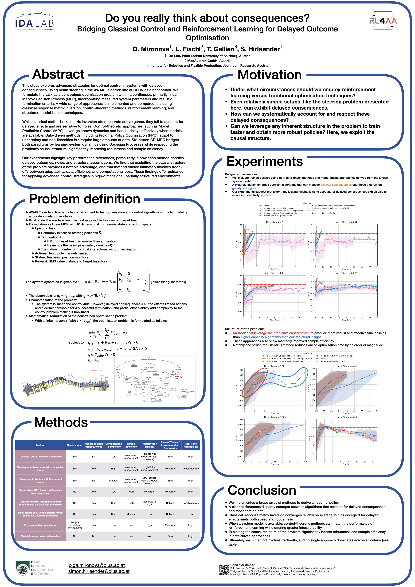

# Do You Really Think About Consequences? Bridging Reinforcement Learning and Control Theory for Long-Term Decision Making

The code for the poster presented at the RL4AA25 workshop at DESY in April 2025.

O. Mironova, L. Fischl, T. Gallien, S. Hirlaender

## Motivation

To demonstrate the strengths of different approaches in decision-making under delayed consequences, we consider a fundamental problem in accelerator physics: beam steering in a linear accelerator (linac). This problem serves as an illustrative example where classical optimization methods, particularly greedy ones, may fall short due to their potential ignorance of long-term effects.

Although the underlying dynamics are simulated as linear in this project, the problem becomes non-trivial due to action constraints (corrector strength limits) and episode termination conditions (e.g., beam offset exceeding limits or reaching a target RMS threshold). These factors can prevent naive greedy algorithms from achieving optimal solutions over an entire episode, highlighting the advantages of techniques that account for delayed consequences, such as Reinforcement Learning (RL) and Model Predictive Control (MPC).

## Project Overview

This project explores advanced control techniques for steering the electron beam in a simulated AWAKE (Advanced Wakefield Experiment) accelerator environment. The core idea is to bridge the gap between Reinforcement Learning (RL) and classical/modern control theory to develop and compare algorithms that can make effective long-term decisions for beam alignment and correction, especially under noisy conditions.

The project implements, trains (where applicable), and evaluates several control policies by running them in the simulated environment under varying noise levels and recording their performance trajectories.

## Key Components

*   **`awake_steering_simulated.py`:** Defines the core simulation environment based on `gymnasium.Env`. It includes linear dynamics (response matrix), action/observation spaces, reward calculation, noise injection, and episode termination logic.
*   **`helper_scripts/helpers.py`:** Contains helper functions (assumed, based on import in `awake_steering_simulated.py`).
*   **`helper_scripts/MPC.py`:** Implements the classical Model Predictive Control (MPC) algorithm assuming a known model (perfect model MPC).
*   **`helper_scripts/linear_Bayesian_mpc.py`:** (Inferred from import) Implements the Linear Bayesian MPC controller, likely learning the system dynamics online.
*   **`helper_scripts/gp_mpc_controller.py`:** (Inferred from import) Implements the standard Gaussian Process (GP) MPC controller.
*   **`helper_scripts/gp_mpc_structured_clean.py`:** Implements the structured (causal) Gaussian Process (GP) MPC controller and associated helper functions.
*   **`Linear_MPC_approach_generate_training_data.py`:** Script to run experiments using the Data-Driven Linear Bayesian MPC, collect data across noise levels/seeds, and save trajectories using `TrajectoryDataManager`.
*   **`GP_MPC_approach_standard_generate_data.py`:** Script to run experiments using the standard Data-Driven GP-MPC, collect data, and save trajectories. Includes model saving/loading.
*   **`GP_MPC_approach_structured_generate-training_data.py`:** Script to run experiments using the structured Data-Driven GP-MPC, collect data, and save trajectories.
*   **`Run_PPO_training.py`:** Trains a Proximal Policy Optimization (PPO) agent using `stable-baselines3` on the environment and saves the trained policy.
*   **`Run_stepwise_optimizsation.py`:** Implements and runs a classical, model-free, *stepwise* optimization approach (e.g., COBYLA) directly on the environment, saving trajectories.
*   **`Run_training_and_tests.py`:** Script to evaluate several pre-defined/trained policies (Analytic, PPO, Random, Model-Based MPC variants, Classical Stepwise) across noise levels/seeds and save their trajectories.
*   **`Read_results_and_create_figures.py`:** Loads the saved trajectory data (`.pkl` files) for different algorithms and noise levels, processes it using pandas, and generates comparative performance plots (e.g., reward vs. time step).
*   **`TrajectoryDataManager` (Class):** Helper class defined within several scripts (`Linear_MPC...`, `GP_MPC...`, `Run_stepwise...`, `Run_training...`) for collecting and saving state, action, and reward histories during experiments.
*   **`config/` (Directory):** Contains configuration files (e.g., `data_driven_mpc_config.yaml`, `environment_setting.yaml`) for controller and environment parameters.
*   **`electron_design.mad`:** (Assumed) Defines the accelerator optics, likely used to generate the response matrix.

## Control Policies Compared

This project implements and compares the following control policies:

1.  **Analytic:** Calculates the corrective action via direct matrix inversion of the (known) system response matrix. Represents a single-step, model-based optimal correction assuming no constraints are violated.
2.  **PPO (Proximal Policy Optimization):** A model-free reinforcement learning algorithm trained to maximize cumulative reward. The policy is learned from interactions with the environment.
3.  **Random:** Applies random actions sampled from the action space at each step. Serves as a baseline.
4.  **Model-Based MPC (Perfect Model):** Uses the known linear model (`env.response`) to optimize actions over a finite prediction horizon. Evaluated with different horizon settings (e.g., `MPC` vs. `MPC_short` which might simulate greedy behavior with a perfect model).
5.  **Stepwise Model-Free Optimization (e.g., COBYLA):** A classical optimization algorithm applied iteratively at each step to find the best *immediate* action based on environment feedback, without an explicit dynamics model.
6.  **Data-Driven Linear Bayesian MPC:** An MPC approach that learns a linear model of the system dynamics online from observed transitions and uses Bayesian inference.
7.  **Data-Driven GP-MPC (Standard):** An MPC approach using Gaussian Processes to learn a non-parametric model of the system dynamics online.
8.  **Data-Driven GP-MPC (Structured/Causal):** A variation of GP-MPC that incorporates structural knowledge (e.g., causality from accelerator physics) into the GP model.

